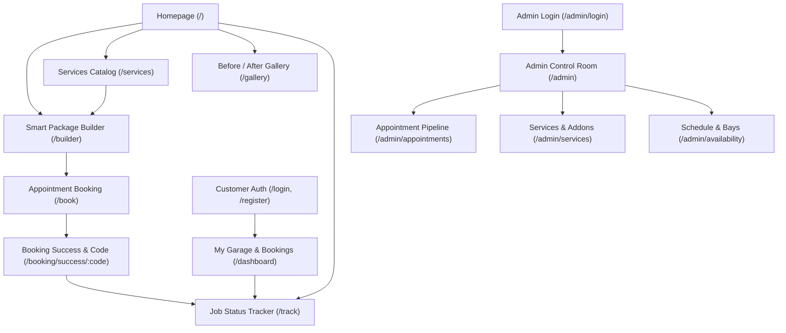

# User Flows Specification — DetailDock

**Project:** DetailDock — Smart Auto Detailing & Service Booking Platform  
**Document Version:** 1.0.0  
**Status:** PROPOSED  
**Date:** 2026-10-09  

---

## 1. Flow Overview & Sitemap

---

## 2. Detailed Flow Specifications

### Flow 1: Smart Package Configuration & Booking (Customer / Guest)

- **Actor:** Customer / Visitor
- **Precondition:** User accesses DetailDock via browser (mobile or desktop).
- **Routes Involved:**
  - Route: `/builder` (Smart Package Builder)
  - Route: `/book` (Appointment Slot & Vehicle Details)
  - Route: `/booking/success/:code` (Confirmation Screen)
- **API Endpoints:**
  - `GET /api/v1/services`
  - `GET /api/v1/addons`
  - `GET /api/v1/vehicles/categories`
  - `GET /api/v1/availability?date=YYYY-MM-DD`
  - `POST /api/v1/bookings` (Creates booking request)

#### Happy Path:
1. User lands on `/builder`.
2. User selects vehicle category (e.g., "Full-size SUV / Truck"). UI updates base multiplier to `1.4x`.
3. User selects a package tier (e.g., "Signature Ceramic Guard").
4. User selects 2 add-ons (e.g., "Engine Bay Detail" + "Leather Conditioning").
5. The live sticky bar computes:
   - Estimated Price: `$385.00`
   - Estimated Duration: `4 Hours 30 Mins`
6. User clicks **"Proceed to Schedule Appointment"**.
7. State transfers to `/book` preserving the selected configuration.
8. User selects an upcoming date on the interactive calendar.
9. System fetches available time slots for that date. User selects `09:30 AM`.
10. User fills in vehicle info (Make: BMW, Model: X5, Year: 2023) and contact info (Name, Phone, Email).
11. User reviews the complete booking summary card showing line-item pricing and vehicle details.
12. User clicks **"Confirm & Request Appointment"**.
13. Server validates price calculation, verifies time-slot capacity, saves booking with status `Pending`, and issues code `DD-92814`.
14. User is redirected to `/booking/success/DD-92814` with a summary and a direct link to track the status.

#### Alternative & Failure Paths:
- **Slot Capacity Exhausted:** If another customer booked the last available bay for that slot while the user was deciding, the server returns `409 Conflict`. UI highlights the slot in red, displays an alert: *"This slot was just claimed. Please choose an adjacent time."*, and refreshes slot options.
- **Client Price Mismatch (Tampering Attempt):** If a malicious client tries to inject `totalPrice: 10`, the server recalculates the exact amount using database multipliers and returns `400 Bad Request: Price calculation verification failed`.
- **Validation Errors:** Missing phone number or vehicle model flags the respective input fields with inline error messages.

---

### Flow 2: Live Job Status Tracking (Customer / Guest)

- **Actor:** Customer
- **Precondition:** Customer holds a booking code (e.g., `DD-92814`) received upon booking.
- **Routes Involved:**
  - Route: `/track` (Search lookup)
  - Route: `/track/:code` (Status dashboard)
- **API Endpoints:**
  - `GET /api/v1/bookings/track/:code`

#### Happy Path:
1. Customer visits `/track` and enters booking reference `DD-92814`.
2. System returns booking details with customer's private phone number partially masked (e.g., `+1 (***) ***-4892` for privacy).
3. The page renders an interactive Status Stepper:
   - `Step 1: Booking Requested` (Completed)
   - `Step 2: Studio Confirmed` (Completed)
   - `Step 3: Vehicle In Detailing Bay` (Active — Pulsing Badge)
   - `Step 4: Quality Inspection` (Upcoming)
   - `Step 5: Ready for Pickup` (Upcoming)
4. Displays estimated pickup time, assigned detailing specialist notes, and contact phone for the shop.

#### Alternative & Failure Paths:
- **Invalid Reference Code:** If code is not found, displays *"No booking found with reference code DD-XXXXX. Please double-check your code or contact support."*

---

### Flow 3: Admin Booking Pipeline Management (Shop Manager)

- **Actor:** Studio Owner / Admin
- **Precondition:** Authenticated with `role: 'admin'` at `/admin/login`.
- **Routes Involved:**
  - Route: `/admin` (Metrics & KPI Overview)
  - Route: `/admin/appointments` (Pipeline Board & Table)
- **API Endpoints:**
  - `GET /api/v1/admin/bookings?status=&date=&search=`
  - `PATCH /api/v1/admin/bookings/:id/status` (Transitions status)
  - `PATCH /api/v1/admin/bookings/:id/reschedule` (Adjusts slot/bay)

#### Happy Path:
1. Admin views Dashboard overview displaying 4 new pending booking requests.
2. Admin opens `/admin/appointments` and clicks on booking `DD-92814`.
3. Drawer slides in showing full customer details, requested vehicle (BMW X5), selected package, add-ons, and total revenue (`$385.00`).
4. Admin clicks **"Approve & Confirm Appointment"**.
5. Status changes from `Pending` to `Confirmed`. An audit log entry is recorded with timestamp.
6. When the vehicle arrives at the shop, technician clicks **"Mark In Bay (In Progress)"**.
7. When work is finished and paint inspected, technician clicks **"Mark Ready for Pickup"**.
8. Customer receives real-time update on their tracking page.
9. When customer picks up and pays at the counter, admin marks **"Completed"**.

#### Alternative Paths:
- **Admin Rejection / Cancellation:** Admin selects **"Decline Request"** with a required reason dropdown (e.g., "Studio maintenance", "Inclement weather"). The slot capacity is immediately released back to the pool.

---

### Flow 4: Admin Service Catalog & Pricing Multiplier Configuration

- **Actor:** Studio Owner
- **Precondition:** Authenticated as Admin.
- **Routes Involved:**
  - Route: `/admin/services`
- **API Endpoints:**
  - `POST /api/v1/admin/services`
  - `PUT /api/v1/admin/services/:id`
  - `PUT /api/v1/admin/vehicles/multipliers`

#### Happy Path:
1. Admin navigates to `/admin/services`.
2. Admin wants to adjust the base rate for "Full-size SUV" from `1.4x` to `1.45x`.
3. Admin updates multiplier in the Vehicle Tier modal and clicks **Save Changes**.
4. The database is updated atomically.
5. All future Smart Package Builder calculations immediately reflect the new `1.45x` multiplier. Existing confirmed bookings preserve their original frozen price snapshot.
