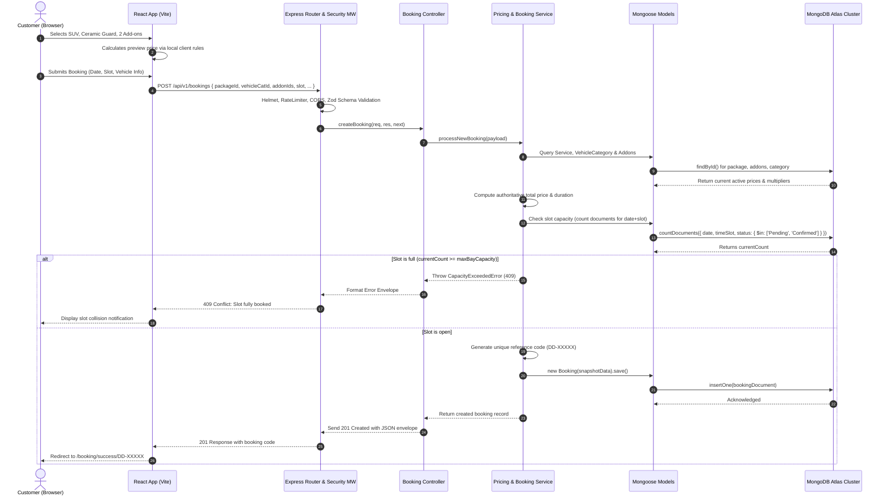

# System Architecture Specification — DetailDock

**Project:** DetailDock — Smart Auto Detailing & Service Booking Platform  
**Document Version:** 1.0.0  
**Status:** PROPOSED  
**Date:** 2026-10-09  
**Stack Baseline:** MongoDB + Express.js + React + Node.js (MERN)  

---

## 1. Architectural Principles

1. **Separation of Concerns:** Strict layer decoupling between Presentation (React), Transport/Routing (Express), Business Logic (Services), and Persistence (Mongoose).
2. **Server-Authoritative Business Logic:** Pricing, discount computations, slot reservation logic, and access controls reside strictly in backend domain services.
3. **Optimized Free-Tier Footprint:** Lightweight memory usage on Node.js/Render and compact document modeling on MongoDB Atlas M0 (512MB).
4. **Idempotency & Concurrency Safety:** Appointment slot allocation uses atomic conditional writes and capacity counting to prevent double bookings.

---

## 2. Vertical Slice Request-Response Pipeline



---

## 3. Directory Layout & Organization

The codebase is organized into a clean monorepo or standard decoupled structure (`client/` and `server/`):

```text
detaildock/
├── client/                     # Frontend Application (React 18 + Vite)
│   ├── public/                 # Static assets, favicon, robots.txt, manifest
│   ├── src/
│   │   ├── assets/             # Brand SVGs, icons, procedural illustrations
│   │   ├── components/         # Reusable UI component library
│   │   │   ├── ui/             # Headless primitives (Button, Modal, Input, Badge, Stepper)
│   │   │   ├── layout/         # Navbar, Footer, AdminSidebar, Container
│   │   │   ├── builder/        # Smart Package Builder interactive widgets
│   │   │   ├── booking/        # Calendar, SlotPicker, SummaryCard
│   │   │   └── home/           # Hero, BeforeAfterSlider, TestimonialCarousel
│   │   ├── context/            # AuthContext, BuilderContext, ToastContext
│   │   ├── hooks/              # usePricingEngine, useAvailability, useBookings
│   │   ├── pages/              # Routed view containers
│   │   │   ├── HomePage.jsx
│   │   │   ├── ServicesPage.jsx
│   │   │   ├── BuilderPage.jsx
│   │   │   ├── BookingPage.jsx
│   │   │   ├── BookingSuccessPage.jsx
│   │   │   ├── TrackJobPage.jsx
│   │   │   ├── LoginPage.jsx
│   │   │   └── admin/
│   │   │       ├── AdminDashboardPage.jsx
│   │   │       ├── AdminAppointmentsPage.jsx
│   │   │       ├── AdminServicesPage.jsx
│   │   │       └── AdminSettingsPage.jsx
│   │   ├── services/           # Axios/Fetch API client wrappers
│   │   ├── styles/             # Tailwind directives & CSS variable tokens
│   │   ├── utils/              # Currency formatters, date helpers, math engines
│   │   ├── App.jsx             # React Router setup & providers
│   │   └── main.jsx            # DOM entrypoint
│   ├── tailwind.config.js
│   ├── vite.config.js
│   └── package.json
│
├── server/                     # Backend REST API Service (Node.js + Express)
│   ├── src/
│   │   ├── config/             # DB connection, Cloudinary, environment loader
│   │   ├── controllers/        # Request/response orchestrators
│   │   │   ├── authController.js
│   │   │   ├── bookingController.js
│   │   │   ├── serviceController.js
│   │   │   └── adminController.js
│   │   ├── middleware/         # Security, auth, error handling, rate limiting
│   │   │   ├── authMiddleware.js
│   │   │   ├── validateMiddleware.js
│   │   │   ├── errorMiddleware.js
│   │   │   └── rateLimitMiddleware.js
│   │   ├── models/             # Mongoose schemas & indexes
│   │   │   ├── User.js
│   │   │   ├── ServicePackage.js
│   │   │   ├── Addon.js
│   │   │   ├── VehicleCategory.js
│   │   │   ├── Booking.js
│   │   │   └── StudioSetting.js
│   │   ├── routes/             # Express API route definitions
│   │   │   ├── authRoutes.js
│   │   │   ├── bookingRoutes.js
│   │   │   ├── serviceRoutes.js
│   │   │   └── adminRoutes.js
│   │   ├── services/           # Core domain business logic
│   │   │   ├── pricingService.js
│   │   │   ├── availabilityService.js
│   │   │   └── bookingService.js
│   │   ├── utils/              # Code generators (DD-XXXXX), logger
│   │   └── server.js           # Express app bootstrap & listener
│   ├── package.json
│   └── .env.example
│
├── docs/                       # Project documentation & control records
├── .agent/PLANS.md             # Architectural execution plans
├── AGENTS.md                   # Repository agent instructions
├── GEMINI.md                   # Workspace rules
└── TASKS.md                    # Live task queue
```

---

## 4. State Management & Data Flow

- **Smart Package Builder State:** Encapsulated in a dedicated lightweight React Context (`BuilderContext`) or custom hook. Stores `{ selectedCategory, selectedPackage, selectedAddonIds, vehicleInfo }`. Persisted in `sessionStorage` so a user refreshing or navigating to login doesn't lose their customized configuration.
- **Server Data Caching:** Simple, clean custom fetch hooks with stale-while-revalidate or lightweight React caching for public service catalogs and slot availability.
- **Authentication State:** Managed via `AuthContext` with JWT stored securely in HTTP-only cookies or client storage with automatic expiration handling.

---

## 5. Security & Error Handling Infrastructure

### 5.1 Centralized Error Handling
- Custom operational error class: `AppError(message, statusCode, errorCode)`.
- All asynchronous controller handlers wrapped with an `asyncHandler` utility to avoid unhandled promise rejections.
- Global Express error middleware intercepts all exceptions, sanitizes stack traces in production, and emits standardized error JSON envelopes.

### 5.2 Security Defense-in-Depth
- **NoSQL Injection:** Mongoose strict query sanitization prevents payload injection like `{ $ne: null }`.
- **CORS:** Configured with whitelist allowing only the official Vercel client domains and `localhost` in development.
- **Helmet:** Enforces secure headers (HSTS, Content-Security-Policy, X-Frame-Options: DENY, X-Content-Type-Options: nosniff).
- **Rate Limiting:** Public booking and auth routes capped at 10 requests per minute per IP to prevent spam and denial of service.
