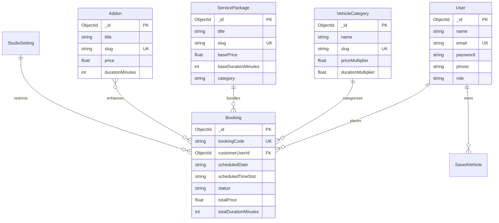

# Data Model & Schema Specification — DetailDock

**Project:** DetailDock — Smart Auto Detailing & Service Booking Platform  
**Document Version:** 1.0.0  
**Status:** PROPOSED  
**Date:** 2026-10-09  
**ODM / Database:** Mongoose v8+ / MongoDB Atlas M0 Cluster  

---

## 1. Schema Design Strategy & Principles

This data model follows the official **MongoDB Schema Design Guidelines** (`mongodb-schema-design`):
1. **"Data that is accessed together is stored together":**
   - Bookings embed customer contact info, vehicle details, and transaction price snapshots.
   - Users embed their personal garage (1:few relationship: 1–3 vehicles per customer).
2. **Immutability of Financial & Service Snapshots:**
   - When a booking is submitted, prices, multipliers, and package titles are frozen as embedded subdocuments. Future price adjustments by the studio manager will never distort historical booking receipts.
3. **Optimized Compound Indexing for High-Frequency Queries:**
   - Slot availability checks evaluate `{ scheduledDate: 1, scheduledTimeSlot: 1, status: 1 }` in milliseconds without scanning the full collection.
4. **Lean Footprint for Free-Tier Atlas (512MB):**
   - No unbounded arrays. Historical logs are bounded or summarized.

---

## 2. Collection Schemas & Entity Specifications

### 2.1 `users` Collection
Stores customer profiles and studio staff/admin credentials.

```javascript
const UserSchema = new mongoose.Schema({
  name: { type: String, required: true, trim: true },
  email: { type: String, required: true, unique: true, lowercase: true, trim: true },
  password: { type: String, required: true, select: false }, // Salted bcrypt hash
  phone: { type: String, required: true, trim: true },
  role: { 
    type: String, 
    enum: ['customer', 'admin', 'technician'], 
    default: 'customer' 
  },
  savedVehicles: [{
    make: { type: String, required: true },
    model: { type: String, required: true },
    year: { type: Number, required: true },
    categorySlug: { type: String, required: true }, // e.g., 'full-suv'
    licensePlate: { type: String, default: '' }
  }],
  isActive: { type: Boolean, default: true }
}, { timestamps: true });

UserSchema.index({ email: 1 }, { unique: true });
```

---

### 2.2 `vehiclecategories` Collection
Defines vehicle body types and their respective pricing multipliers.

```javascript
const VehicleCategorySchema = new mongoose.Schema({
  name: { type: String, required: true }, // e.g., 'Full-size SUV / Truck'
  slug: { type: String, required: true, unique: true, lowercase: true }, // e.g., 'full-suv'
  priceMultiplier: { type: Number, required: true, default: 1.0 }, // e.g., 1.40
  durationMultiplier: { type: Number, required: true, default: 1.0 }, // e.g., 1.30
  description: { type: String, default: '' },
  iconName: { type: String, default: 'Truck' }, // Lucide icon identifier
  displayOrder: { type: Number, default: 0 },
  isActive: { type: Boolean, default: true }
}, { timestamps: true });

VehicleCategorySchema.index({ slug: 1 }, { unique: true });
VehicleCategorySchema.index({ isActive: 1, displayOrder: 1 });
```

---

### 2.3 `servicepackages` Collection
Defines core detailing tiers and packages.

```javascript
const ServicePackageSchema = new mongoose.Schema({
  title: { type: String, required: true }, // e.g., 'Signature Ceramic Guard'
  slug: { type: String, required: true, unique: true, lowercase: true },
  tagline: { type: String, default: '' },
  description: { type: String, required: true },
  basePrice: { type: Number, required: true }, // Price for 1.0x vehicle (e.g., $249)
  baseDurationMinutes: { type: Number, required: true }, // e.g., 180 (3 hrs)
  category: { 
    type: String, 
    enum: ['wash', 'interior', 'exterior', 'full', 'ceramic'], 
    default: 'full' 
  },
  includedFeatures: [{ type: String }],
  isPopular: { type: Boolean, default: false },
  displayOrder: { type: Number, default: 0 },
  isActive: { type: Boolean, default: true }
}, { timestamps: true });

ServicePackageSchema.index({ slug: 1 }, { unique: true });
ServicePackageSchema.index({ isActive: 1, displayOrder: 1 });
```

---

### 2.4 `addons` Collection
A la carte service upgrades selectable in the Smart Package Builder.

```javascript
const AddonSchema = new mongoose.Schema({
  title: { type: String, required: true }, // e.g., 'Engine Bay Steam Clean'
  slug: { type: String, required: true, unique: true, lowercase: true },
  description: { type: String, default: '' },
  price: { type: Number, required: true }, // Flat add-on price (e.g., $65)
  durationMinutes: { type: Number, required: true, default: 30 },
  iconName: { type: String, default: 'Sparkles' },
  displayOrder: { type: Number, default: 0 },
  isActive: { type: Boolean, default: true }
}, { timestamps: true });

AddonSchema.index({ slug: 1 }, { unique: true });
AddonSchema.index({ isActive: 1, displayOrder: 1 });
```

---

### 2.5 `bookings` Collection (Central Transaction Entity)
Encapsulates all reservation, vehicle, pricing snapshot, and status data.

```javascript
const BookingSchema = new mongoose.Schema({
  bookingCode: { 
    type: String, 
    required: true, 
    unique: true, 
    uppercase: true, 
    index: true 
  }, // e.g., 'DD-84920'
  
  // Customer details (Snapshot: guest or registered)
  customer: {
    userId: { type: mongoose.Schema.Types.ObjectId, ref: 'User', default: null },
    name: { type: String, required: true },
    email: { type: String, required: true, lowercase: true },
    phone: { type: String, required: true }
  },

  // Vehicle information & multiplier snapshot
  vehicle: {
    make: { type: String, required: true }, // e.g., 'Porsche'
    model: { type: String, required: true }, // e.g., 'Taycan'
    year: { type: Number, required: true },
    categoryName: { type: String, required: true }, // 'Sedan / Hatchback'
    categorySlug: { type: String, required: true },
    multiplierApplied: { type: Number, required: true }, // 1.10
    licensePlate: { type: String, default: '' },
    paintColor: { type: String, default: '' }
  },

  // Service package snapshot (frozen pricing at time of checkout)
  packageSnapshot: {
    packageId: { type: mongoose.Schema.Types.ObjectId, ref: 'ServicePackage' },
    title: { type: String, required: true },
    basePrice: { type: Number, required: true },
    calculatedPrice: { type: Number, required: true },
    durationMinutes: { type: Number, required: true }
  },

  // Add-ons snapshot
  addonsSnapshot: [{
    addonId: { type: mongoose.Schema.Types.ObjectId, ref: 'Addon' },
    title: { type: String, required: true },
    price: { type: Number, required: true },
    durationMinutes: { type: Number, required: true }
  }],

  // Authoritative financial summary
  totalPrice: { type: Number, required: true }, // Authoritative server calculation
  totalDurationMinutes: { type: Number, required: true },

  // Scheduling
  scheduledDate: { type: Date, required: true, index: true }, // YYYY-MM-DD (Midnight UTC)
  scheduledTimeSlot: { type: String, required: true, index: true }, // '09:30 AM'
  bayNumber: { type: Number, default: 1 },

  // Lifecycle status
  status: {
    type: String,
    enum: ['Pending', 'Confirmed', 'In Progress', 'Ready', 'Completed', 'Cancelled'],
    default: 'Pending',
    index: true
  },

  notes: { type: String, default: '' },
  adminNotes: { type: String, default: '' },
  cancellationReason: { type: String, default: '' },

  // Audit trail for status changes
  statusHistory: [{
    status: { type: String, required: true },
    changedAt: { type: Date, default: Date.now },
    changedBy: { type: String, default: 'Customer' },
    note: { type: String, default: '' }
  }]
}, { timestamps: true });

// High-speed compound index for slot availability & capacity check
BookingSchema.index({ scheduledDate: 1, scheduledTimeSlot: 1, status: 1 });
BookingSchema.index({ 'customer.email': 1, createdAt: -1 });
```

---

### 2.6 `studiosettings` Collection
Single-document collection defining studio operating hours, capacity, and business rules.

```javascript
const StudioSettingSchema = new mongoose.Schema({
  studioName: { type: String, default: 'DetailDock Studio' },
  contactPhone: { type: String, default: '+1 (555) 348-2450' },
  contactEmail: { type: String, default: 'concierge@detaildock.com' },
  address: {
    street: { type: String, default: '1440 Velocity Way, Suite 100' },
    city: { type: String, default: 'Austin' },
    state: { type: String, default: 'TX' },
    zip: { type: String, default: '78701' }
  },
  operatingHours: {
    openTime: { type: String, default: '08:30 AM' },
    closeTime: { type: String, default: '06:00 PM' },
    slotIntervalMinutes: { type: Number, default: 120 } // 2-hour increments
  },
  maxBayCapacity: { type: Number, default: 2 }, // Max concurrent vehicles
  workingDays: [{ type: Number, default: [1, 2, 3, 4, 5, 6] }], // Mon-Sat
  blackoutDates: [{ type: Date }]
}, { timestamps: true });
```

---

## 3. Entity Relationship Diagram (ERD)


