# Technical Requirements Document (TRD) — DetailDock

**Project:** DetailDock — Smart Auto Detailing & Service Booking Platform  
**Document Version:** 1.0.0  
**Status:** PROPOSED  
**Date:** 2026-10-09  
**Stack Baseline:** MongoDB + Express.js + React + Node.js (MERN)  

---

## 1. Technical Stack & Environment

### 1.1 Core Technologies
- **Frontend Client:** React 18+ (SPA), bundled with Vite. Single-page navigation powered by React Router v6+.
- **Backend Application:** Node.js (v20+ LTS) running an Express.js REST API service with modular architecture (Routes, Controllers, Services, Middleware).
- **Database Layer:** MongoDB Atlas (M0 Shared Cluster, 512MB Free Tier) connected via Mongoose ODM (v8+).
- **Styling Architecture:** Tailwind CSS (v3/v4), Radix UI headless primitives, custom `shadcn/ui` design components, and custom CSS variables for dark luxury theme.
- **Motion & Physics:** `motion` (formerly Framer Motion, MIT) utilizing Emil Kowalski spring transition curves.

### 1.2 Approved Dependencies & Licensing Whitelist
Every dependency added to `package.json` must strictly conform to ADR-004 (Permissive Open-Source Only):

| Package / Module | Purpose | License | Layer |
| :--- | :--- | :--- | :--- |
| `react` / `react-dom` | Reactive UI framework | MIT | Client |
| `react-router-dom` | Client routing & layout nesting | MIT | Client |
| `lucide-react` | Ultra-clean iconography | ISC | Client |
| `motion` | UI micro-interactions & steppers | MIT | Client |
| `clsx` & `tailwind-merge` | Dynamic utility class composition | MIT | Client |
| `express` | HTTP server & routing framework | MIT | Server |
| `mongoose` | Strict schema validation & MongoDB driver | MIT | Server |
| `cors` | Cross-Origin Resource Sharing control | MIT | Server |
| `helmet` | Security HTTP headers protection | MIT | Server |
| `express-rate-limit` | Brute force & DDoS rate limiting | MIT | Server |
| `bcryptjs` | Password hashing (salted 12 rounds) | MIT | Server |
| `jsonwebtoken` | Stateless JWT tokens for authentication | MIT | Server |
| `zod` | Server & client schema validation | MIT | Both |
| `cloudinary` | Cloud image upload and auto-format | MIT | Server |

---

## 2. System Architecture & Component Topology

```mermaid
flowchart LR
    subgraph Client ["Client Layer (Vercel)"]
        UI["React 18 SPA (Vite)"]
        State["Zustand / React Context (Builder & Auth)"]
        APIClient["Axios / Fetch API Client"]
        UI --> State
        State --> APIClient
    end

    subgraph CDN ["Media CDN (Cloudinary)"]
        CloudinaryCDN["Cloudinary Free Tier (Optimized WebP/AVIF)"]
    end

    subgraph Server ["Backend API (Render)"]
        Express["Express.js Server"]
        MW["Security Middleware (Helmet, CORS, Rate Limit, JWT)"]
        Routes["API Routes (/api/v1/...)"]
        Controllers["Controllers & Services"]
        Mongoose["Mongoose ODM Models"]
        
        Express --> MW
        MW --> Routes
        Routes --> Controllers
        Controllers --> Mongoose
    end

    subgraph Database ["Database Layer (Atlas)"]
        AtlasCluster["MongoDB Atlas M0 Cluster (cluster0.na6yl4b.mongodb.net)"]
    end

    APIClient -->|HTTPS REST| Express
    Mongoose -->|TLS Mongoose Driver| AtlasCluster
    UI -.->|Direct Image Fetch| CloudinaryCDN
    Controllers -.->|Media Upload & Signed URLs| CloudinaryCDN
```



---

## 3. API Design & Standards

### 3.1 RESTful Conventions
- **Base URI:** `/api/v1`
- **Content-Type:** `application/json`
- **Standardized Response Envelope:**
```json
{
  "success": true,
  "data": { ... },
  "message": "Resource retrieved successfully",
  "meta": { "timestamp": "2026-10-09T01:30:00Z" }
}
```
- **Standardized Error Envelope:**
```json
{
  "success": false,
  "error": {
    "code": "SLOT_CAPACITY_EXCEEDED",
    "message": "The selected time slot is fully booked for this date.",
    "details": []
  }
}
```

### 3.2 Endpoint Inventory Matrix

| Endpoint | Method | Access | Purpose |
| :--- | :--- | :--- | :--- |
| `/api/v1/services` | `GET` | Public | List all active detailing services and packages |
| `/api/v1/addons` | `GET` | Public | List all optional add-on services |
| `/api/v1/vehicles/categories`| `GET` | Public | List vehicle categories and price multipliers |
| `/api/v1/pricing/calculate` | `POST` | Public | Calculate authoritative server-side price & duration |
| `/api/v1/availability` | `GET` | Public | Query open bays/time slots for a given date |
| `/api/v1/bookings` | `POST` | Public / Guest | Submit a new appointment booking |
| `/api/v1/bookings/track/:code`| `GET` | Public | Publicly look up booking status via booking code |
| `/api/v1/auth/register` | `POST` | Public | Customer registration |
| `/api/v1/auth/login` | `POST` | Public | Customer & Admin login (returns JWT) |
| `/api/v1/auth/me` | `GET` | Authenticated | Fetch current user session |
| `/api/v1/admin/bookings` | `GET` | Admin | Query bookings with status, date, and search filters |
| `/api/v1/admin/bookings/:id/status` | `PATCH` | Admin | Transition booking status (Pending ➔ Confirmed, etc.) |
| `/api/v1/admin/services` | `POST` | Admin | Create new service or package |
| `/api/v1/admin/services/:id` | `PUT` | Admin | Update existing service |
| `/api/v1/admin/settings/availability` | `PUT` | Admin | Update business hours & bay capacity |

---

## 4. Concurrency & Business Rules

### 4.1 Server Authority Over Pricing
Under NO circumstances will the server persist client-supplied pricing directly.
When `/api/v1/bookings` is invoked:
1. Server receives `{ vehicleCategoryId, packageId, addonIds: [...] }`.
2. Server queries current MongoDB documents for base price, category multiplier, and add-on costs.
3. Server executes:
   $$\text{Subtotal} = (\text{BasePackagePrice} \times \text{Multiplier}) + \sum \text{AddonPrices}$$
4. Computed pricing is frozen and stored in the `Booking` document as a transaction record snapshot.

### 4.2 Double-Booking & Slot Capacity Guard
1. Detailing bay capacity per slot is configurable (default: `2` concurrent vehicles).
2. Before inserting a new booking, Mongoose executes a count query on confirmed/pending bookings matching `{ date, timeSlot }`.
3. If `count >= maxBayCapacity`, the transaction is aborted with `409 Conflict`.

---

## 5. Free-Tier Cloud Optimization Rules

1. **MongoDB Atlas M0 (512MB):**
   - Strictly avoid unbounded embedded arrays.
   - Use lean projections (`.select('title price')`) to minimize memory usage.
   - Clean up expired demo sessions via TTL index if necessary.
2. **Render Web Service (Free Tier):**
   - Service sleeps after 15 minutes of idle time.
   - Implement frontend loading skeleton and friendly "Waking up cloud service..." toaster if first API call takes > 5 seconds.
3. **Vercel Hobby Tier:**
   - Static asset caching (`Cache-Control: public, max-age=31536000, immutable`).
   - Client bundle split via dynamic imports (`React.lazy`).
4. **Cloudinary (25 Monthly Credits):**
   - Use URL-based automatic transformations: `f_auto,q_auto,w_1200` to deliver lightweight WebP/AVIF images.
